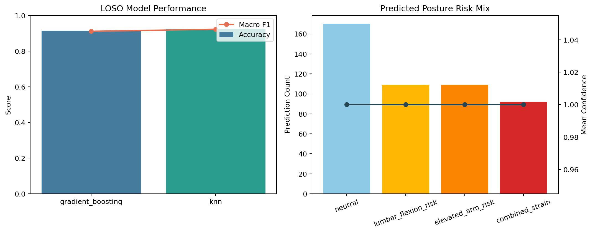

# Ergonomic Posture Assessment and Personalised Recommendation

Wearable-sensor posture assessment pipeline for detecting at-risk postures and translating them into practical ergonomic guidance. The repository combines posture-risk classification with a recommendation layer so the project reads like a real decision-support workflow rather than a standalone model notebook.



## Project Snapshot

- Focus: ergonomic risk assessment for occupational and nursing-style movement tasks
- Inputs: trunk flexion, arm elevation, neck angle, asymmetry, load, and motion intensity
- Models: Gradient Boosting and k-NN under leave-one-subject-out validation
- Output layer: plain-language ergonomic recommendations mapped from predicted posture risks
- Current demo result: `92.5%` leave-one-subject-out accuracy with k-NN

## Why It Matters

Ergonomic assessment becomes more useful when it moves beyond binary posture labels and connects model output to action. This repo is designed around that translation step:

- identify posture patterns linked to musculoskeletal strain
- test whether the classifier generalises to unseen subjects
- convert predictions into intervention suggestions a user can actually follow

## What This Repo Includes

- Posture-risk classification with Gradient Boosting and k-NN
- Leave-one-subject-out cross-validation for cross-user generalisation
- Features representing trunk flexion, arm elevation, asymmetry, load, and motion intensity
- Rule-based recommendation engine that turns posture predictions into actionable guidance
- CLI that exports predictions, model artifacts, and metrics

## Quick Start

```bash
python -m pip install -r requirements.txt
python -m pip install -e .
python -m ergonomic_posture.cli --output-dir reports/demo
```

## Demo Results

| Model | Evaluation setup | Accuracy | Macro F1 |
| --- | --- | ---: | ---: |
| Gradient Boosting | Leave-one-subject-out | 0.915 | 0.911 |
| k-NN | Leave-one-subject-out | 0.925 | 0.922 |

Representative recommendation generated by the demo pipeline:

> Reduce trunk flexion and move the task closer to waist height. Adjust arm height or task surface to keep shoulders below high reach.

## Example Outputs

- `reports/demo/metrics.json` with fold-wise evaluation metrics
- `reports/demo/posture_predictions.csv` with predictions, confidence scores, and generated recommendations
- `reports/demo/posture_overview.png` summarising performance and predicted posture mix
- `reports/demo/knn_model.joblib` or the currently best model artifact
- `models/demo/knn_model.joblib` as the saved demo estimator
- `notebooks/demo_walkthrough.ipynb` for Jupyter-based inspection

## Project Structure

- `src/ergonomic_posture/` classification and recommendation logic
- `tests/` smoke test for the demo run
- `reports/` generated outputs such as metrics and recommendations
- `models/demo/` stored demo model artifact
- `notebooks/demo_walkthrough.ipynb` starter analysis notebook
- `data/` place real wearable or joint-angle datasets here
- `models/` reserved for persisted trained estimators

## Replacing The Demo Data

The current synthetic generator creates subject-specific posture windows with neutral, lumbar-flexion, elevated-arm, and combined-strain patterns. To switch to real data, supply a dataframe with:

- `subject_id`
- one row per posture window or task segment
- the feature columns listed in `src/ergonomic_posture/pipeline.py`
- a target label column named `posture_label`

## Repo Strengths

- Connects model predictions to user-facing ergonomic advice
- Uses leave-one-subject-out validation instead of easier random splits
- Can be demoed immediately while still being ready for real sensor data
- Reads well as both an ML project and an occupational-health application
