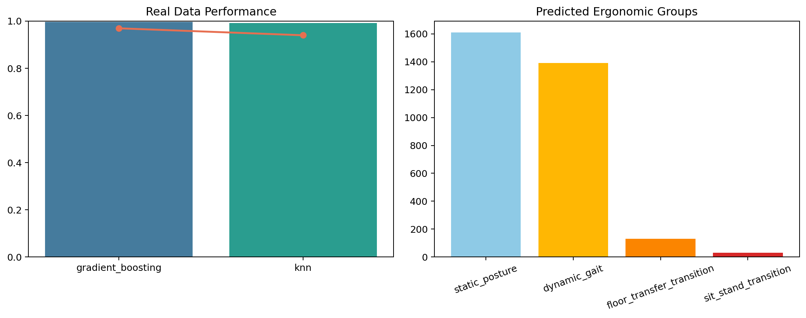

# Ergonomic Posture Assessment and Personalised Recommendation

Real-data posture-state and transition assessment pipeline built on the official UCI Smartphone-Based Recognition of Human Activities and Postural Transitions dataset. The repository trains on the real benchmark split, predicts ergonomic posture-state groups, and maps them into user-facing movement recommendations.



## Dataset

- UCI Smartphone-Based Recognition of Human Activities and Postural Transitions
- 30 subjects, waist-mounted smartphone IMU, subject-disjoint train/test split
- Original labels are grouped into ergonomic states:
  - `static_posture`
  - `dynamic_gait`
  - `sit_stand_transition`
  - `floor_transfer_transition`

## Current Results

| Model | Evaluation | Accuracy | Macro F1 |
| --- | --- | ---: | ---: |
| HistGradientBoosting | Official subject-disjoint test split | 0.997 | 0.969 |
| k-NN | Official subject-disjoint test split | 0.992 | 0.940 |

## What The Pipeline Does

- loads the real UCI posture-transition feature matrices
- groups raw labels into ergonomic posture-state categories
- trains Gradient Boosting and k-NN baselines
- generates posture recommendations from predicted ergonomic groups
- saves predictions, plots, and model artifacts to tracked result folders

## Run It

```bash
python -m pip install -r requirements.txt
python -m pip install -e .
python -m ergonomic_posture.cli --output-dir reports/results --model-dir models/results
```

## Output Files

- `reports/results/metrics.json`
- `reports/results/posture_predictions.csv`
- `reports/results/posture_overview.png`
- `models/results/best_posture_model.joblib`
- `notebooks/real_data_walkthrough.ipynb`

## Notes

- Raw downloaded files live in `data/raw/` and are ignored by git.
- Recommendations are derived from real predicted posture-state groups, not synthetic labels.
